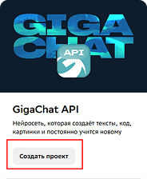
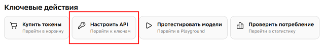
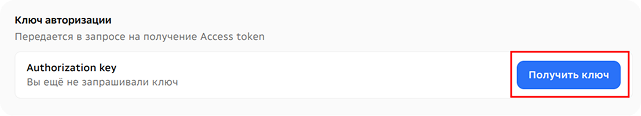

# Инструкция по получению GigaChat API

## Шаг 1: Регистрация аккаунта

- [Зарегистрируйте аккаунты для тьютора и ребенка.](https://developers.sber.ru/studio/registration)

## Шаг 2: Получение API-ключа
### Создать проект GigaChat API
 

### Получение API ключа в проекте

## Важная информация
**В рамках Freemium-режима пользователи получают 1 000 000 бесплатных токенов для генерации текста**
- **Тарифы**: Ознакомьтесь с актуальными тарифами для индивидуальных пользователей по [этой ссылке](https://developers.sber.ru/docs/ru/gigachat/tariffs/individual-tariffs).
